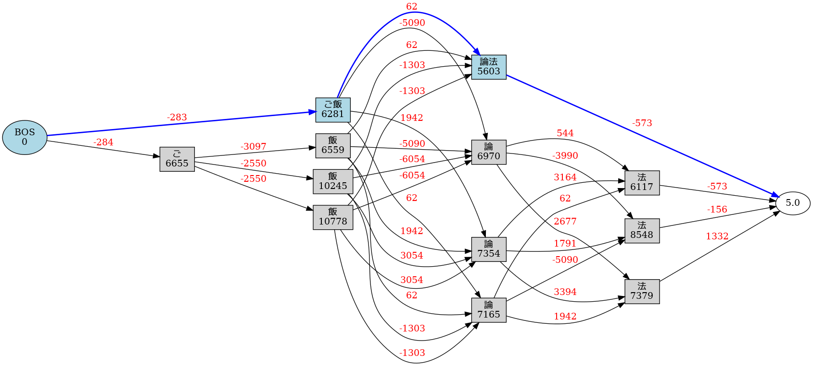
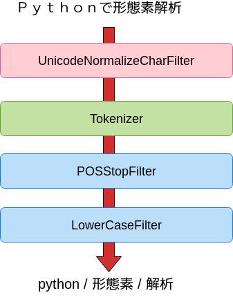
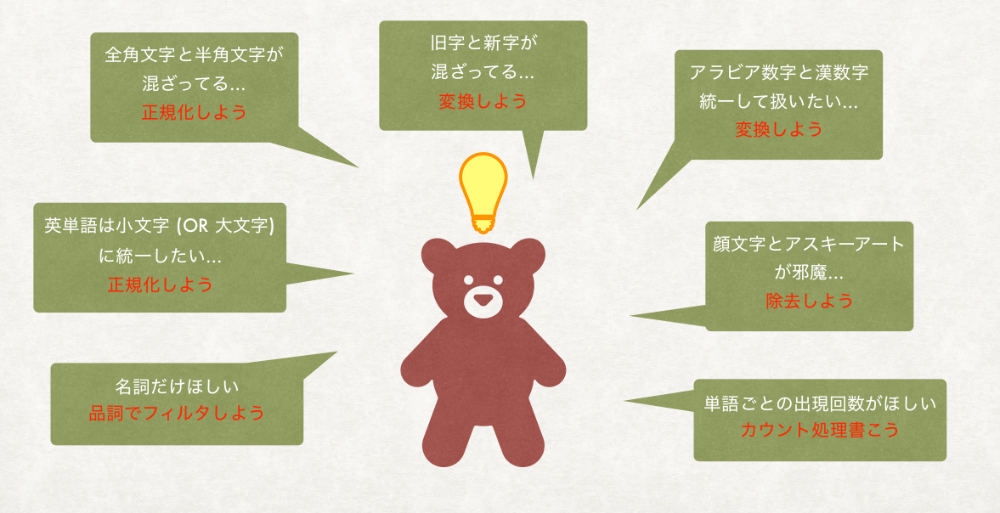
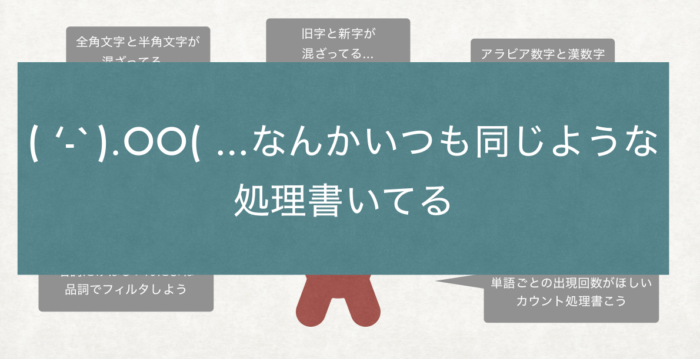
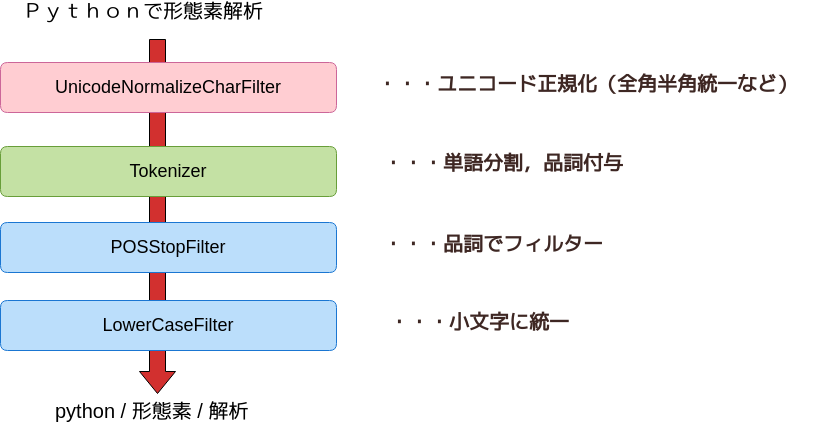
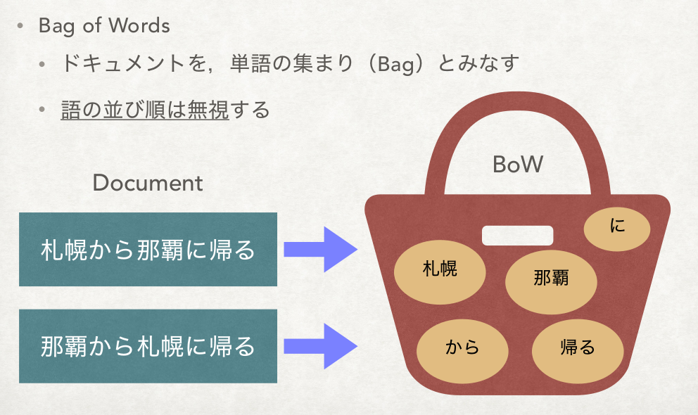
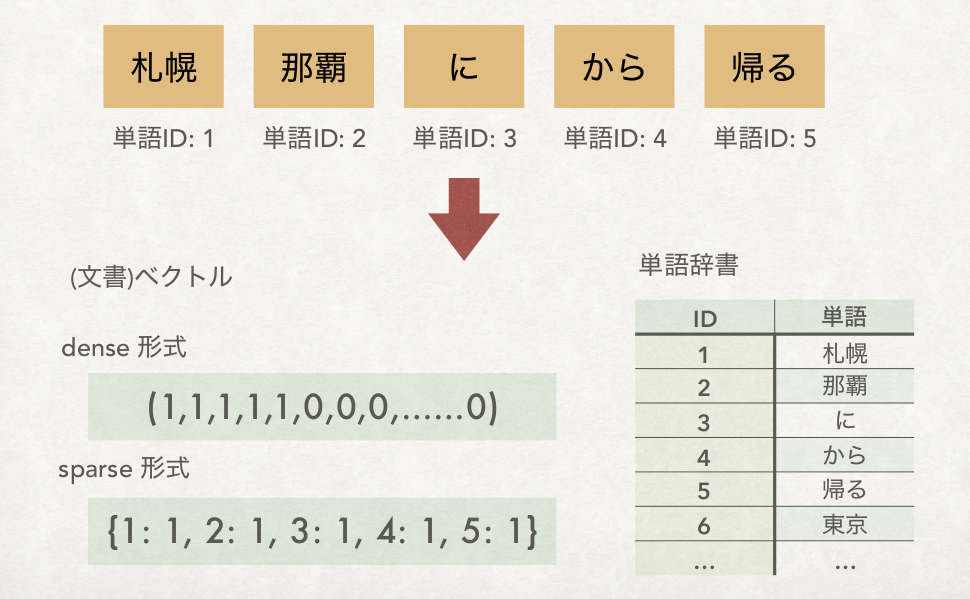

% Janome ではじめるテキストマイニング
% Tomoko Uchida
% Last Updated 2019.03.03

## このチュートリアル（ハンズオン）について

- [PythonBeginners沖縄 (2018/12/23)](https://python-beginners-okinawa.connpass.com/event/111732/) の [ハンズオン教材](https://github.com/mocobeta/PyBeginners201812) を，Google Colab 上で実行できるようにしたものです。
- Web ブラウザがあれば，手元に Python 環境がなくても実施できます。
- テキストマイニング・自然言語処理をこれから始めてみたい方を対象に，形態素解析，WordCloud, テキスト前処理/後処理，TFIDF など，ごく基本的な知識をつけてもらうことを目的としています。
- テキストマイニング・自然言語処理の予備知識は不要ですが，Python の読み書きがある程度できたほうがスムーズに進められます。
- はじめる前に，GitHub の [janome-tutorial](https://github.com/mocobeta/janome-tutorial) リポジトリをチェックアウトしておいてください。
- 不具合，要望，ご意見の連絡は [moco_beta](https://twitter.com/moco_beta) (Twitter) か GitHub リポジトリの issue でお寄せください。

## Who am I 

{width=80}

* Twitter: @moco_beta
* ソフトウェアエンジニア (Web開発, 検索/自然言語処理 が好き)
* [Janome](https://mocobeta.github.io/janome/) 開発者
* [Luke: Lucene Toolbox Project](https://github.com/DmitryKey/luke) メンテナー
* [改訂3版 Apache Solr 入門](http://gihyo.jp/book/2017/978-4-7741-8930-7) 共著者

## はじめよう

### 形態素解析 〜 WordCloud

{width=400}

## Janome 紹介

- Pure Python で書かれた，辞書内包の形態素解析ライブラリ

```
(venv) $ pip install janome
(venv) $ python
>>> from janome.tokenizer import Tokenizer
>>> t = Tokenizer()
>>> for token in t.tokenize('すもももももももものうち'):
...     print(token)
... 
すもも	名詞,一般,*,*,*,*,すもも,スモモ,スモモ
も	助詞,係助詞,*,*,*,*,も,モ,モ
もも	名詞,一般,*,*,*,*,もも,モモ,モモ
も	助詞,係助詞,*,*,*,*,も,モ,モ
もも	名詞,一般,*,*,*,*,もも,モモ,モモ
の	助詞,連体化,*,*,*,*,の,ノ,ノ
うち	名詞,非自立,副詞可能,*,*,*,うち,ウチ,ウチ
```

## 特徴

- 辞書，言語モデルは mecab-ipadic-2.7.0-20070801 を使用
- => だいたいは MeCab と同じ解析結果になります。未知語処理で差異がでます
- Pure Python かつ標準ライブラリのみ使用
- => 環境問わずだいたいどこでも動く (RAM 2GB 以上推奨)
- ユーザー辞書サポート
- => MeCab 辞書フォーマット / Kuromoji ライクな簡略フォーマット
- => 手軽に単語追加が試せます

## Janome を支えるアルゴリズム

すもも / も   / もも / も   / もも / の   / うち

名詞   / 助詞 / 名詞 / 助詞 / 名詞 / 助詞 / 名詞

### 必要な知識

- 語彙: 「すもも」「もも」という名詞，「も」「の」という助詞（辞書）
- 日本語らしさ: 名詞のあとには助詞がきやすい（言語モデル）

## Janome を支えるアルゴリズム

### 辞書と言語モデル

- 人手で整備
- コーパス（学習データ）から教師あり機械学習
- 一般にはこのハイブリッド
- Janome は既存の辞書/言語モデルである mecab-ipadic を借用しています

## Janome を支えるアルゴリズム

- Janome で実装したのは，いわゆる解析エンジン部分
- 辞書引き: PyConJP 2015 で発表した時の[資料](https://www.slideshare.net/tomokouchida505/pyconjp2015-python)で解説しています
- 解析実行: 解析対象の文字列を受け取って，もっとも「日本語らしい」分割ポイントをさがす

## 解析の様子をみてみよう

- v0.3.7 から，ラティスグラフの可視化ができるようになりました（※ 要 Graphviz）

```
(venv) $ echo "ご飯論法" | janome -g
ご飯	名詞,一般,*,*,*,*,ご飯,ゴハン,ゴハン
論法	名詞,一般,*,*,*,*,論法,ロンポウ,ロンポー
Graph was successfully output to lattice.gv.png
```

{width=1000}

## ハンズオン 0. Google Colab の練習

ハンズオン（演習）は Google Colab 環境で行います。

[https://colab.research.google.com/drive/1ayYqeCEHoAv07MQxTWCDE0NIQc-cEpOu](https://colab.research.google.com/drive/1ayYqeCEHoAv07MQxTWCDE0NIQc-cEpOu)

にアクセスして，Google Colab の使い方に慣れましょう。

## ハンズオン 1. はじめよう！

[https://colab.research.google.com/drive/12CxsYiA1V5e1lHJ0Q95G7G-sjZx5YqWc](https://colab.research.google.com/drive/12CxsYiA1V5e1lHJ0Q95G7G-sjZx5YqWc)

- Janome CLI を使いこなそう
- Janome API を使いこなそう
- ユーザー定義辞書を使いこなそう

にチャレンジ！

## ハンズオン 2. WordCloud

[https://colab.research.google.com/drive/1xI-Uwedy-lvv689o7-u0N8Jg6i7vLoxG](https://colab.research.google.com/drive/1xI-Uwedy-lvv689o7-u0N8Jg6i7vLoxG)

- 英語のテキストから WordCloud を作る
- 日本語のテキストから WordCloud を作る

にチャレンジ！

## 前処理と後処理

### Analyzer Framework



## だいじな前処理，便利な後処理

- 形態素解析だけでは，現実のテキスト分析ニーズとはたたかえない

{width=900}

## だいじな前処理，便利な後処理

- 形態素解析だけでは，現実のテキスト分析ニーズとはたたかえない

{width=900}

## だいじな前処理，便利な後処理

- 形態素解析だけでは，現実のテキスト分析ニーズとはたたかえない

{width=900}

## Analyzer フレームワーク

- Analyzer は，形態素解析の前処理・後処理をテンプレ化するためのフレームワークです。下記のクラスを含みます
- 文字の正規化などの前処理を行う CharFilter クラス
- 小文字化，品詞によるトークンのフィルタリングなど，形態素解析後の後処理を行う TokenFilter クラス
- CharFilter, Tokenizer, TokenFilter を組み合わせてカスタム解析フローを組み立てる Analyzer クラス

## Analyzer フレームワーク



## Analyzer フレームワーク

```
>>> from janome.tokenizer import Tokenizer
>>> from janome.analyzer import Analyzer
>>> from janome.charfilter import *
>>> from janome.tokenfilter import *
>>> text = 'Ｐｙｔｈｏｎで形態素解析'
>>> char_filters = [UnicodeNormalizeCharFilter()]
>>> token_filters = [POSStopFilter(['記号','助詞']), LowerCaseFilter()]
>>> tokenizer = Tokenizer()
>>> a = Analyzer(char_filters, tokenizer, token_filters)
>>> for token in a.analyze(text):
...     print(token)
... 
python	名詞,一般,*,*,*,*,python,*,*
形態素	名詞,一般,*,*,*,*,形態素,ケイタイソ,ケイタイソ
解析	名詞,サ変接続,*,*,*,*,解析,カイセキ,カイセキ
```

## ビルトイン CharFilter

(2019/3 現在)

- RegexReplaceCharFilter : 入力文字列の，指定された正規表現にマッチする箇所を指定の文字列で置換します
- UnicodeNormalizeCharFilter : 入力文字列をユニコード正規化します

## ビルトイン TokenFilter

(2019/3 現在)

- LowerCaseFilter : 表層形の小文字化を行います
- UpperCaseFilter : 表層形の大文字化を行います
- POSStopFilter : 指定された品詞タグにマッチするトークンを除去します
- POSKeepFilter : 指定された品詞タグにマッチするトークンのみ残し，その他を除去します
- CompoundNounFilter : 連続する名詞をひとつにまとめ，複合名詞にします。まとめられたトークンには「名詞,複合」という特殊な品詞がつきます
- ExtractAttributeFilter : 指定された属性（プロパティ）を各トークンから抽出します
- TokenCountFilter : 入力文字列中の単語ごとの出現頻度を数えます

## ハンズオン 3. Analyzer

[https://colab.research.google.com/drive/109TJG4dH5Q07cdv4jhB1DeQHQ3zLz9G3](https://colab.research.google.com/drive/109TJG4dH5Q07cdv4jhB1DeQHQ3zLz9G3)

- ワードカウント
- カスタムフィルター
- WordCloud 再考

にチャレンジ！

## 特徴語抽出

### TFIDF, 用語抽出

## BoW (Bag of Words) と ベクトル化と TFIDF



## BoW (Bag of Words) と ベクトル化と TFIDF



## BoW (Bag of Words) と ベクトル化と TFIDF

ベクトルの要素（値）の決め方はいろいろある

1. 単語あり/なしだけを表現 : 1 or 0
2. 単語の出現回数をそのまま使う : 0 以上の整数値
3. （そのドキュメントにおける）単語の「重要度」を計算する

3 の重要度には，伝統的に TFIDF のバリエーションが使われることが多い

いろいろな TFIDF : [Document and query weighting schemes ](https://nlp.stanford.edu/IR-book/html/htmledition/document-and-query-weighting-schemes-1.html)


## キーワード抽出

- 固有表現抽出（人名，地名，日付表現，組織名，etc.）
- ex. 係り受け解析器 [CaboCha](https://taku910.github.io/cabocha/) に付属
- Entity Linking / Wikification
- Key Phrase Extraction
- ex. [pke - Python Keyphrase Extraction module](https://github.com/boudinfl/pke)
- Burst Detection
- ex. Jubatus ([jubaburst](http://jubat.us/ja/api/api_burst.html))

## termextract

専門用語（キーワード）自動抽出 Python モジュール termextract

- [http://gensen.dl.itc.u-tokyo.ac.jp/pytermextract/](http://gensen.dl.itc.u-tokyo.ac.jp/pytermextract/)
- MeCab または janome を使ったサンプルスクリプトが同梱されているので，手軽に試せます

## ハンズオン 4. キーワード抽出

[https://colab.research.google.com/drive/11obx4RtQP6Z_EqfRoKaz4Fa_FKoBKi4M](https://colab.research.google.com/drive/11obx4RtQP6Z_EqfRoKaz4Fa_FKoBKi4M)

- BoW と TFIDF with gensim
- termextract (専門用語抽出)

にチャレンジ！

## Appendix 使用しているソフトウェア

このハンズオンをローカル環境で実行する時に必要なソフトウェアです。

Python ライブラリ

- Jupyter Notebook : https://jupyter.org/install (これはなくても良い)
- Janome : https://mocobeta.github.io/janome/
- wordcloud : https://github.com/amueller/word_cloud
- gensim : https://radimrehurek.com/gensim/
- termextract : http://gensen.dl.itc.u-tokyo.ac.jp/pytermextract/

パッケージソフト，その他

- Graphviz : https://www.graphviz.org/
- IPA フォント : https://ipafont.ipa.go.jp/old/ipafont/download.html
